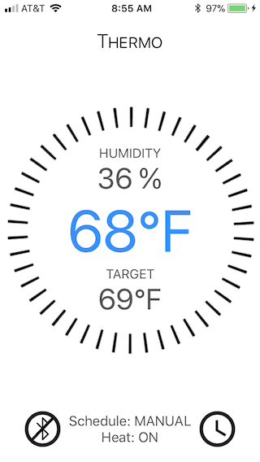

# Thermo
Simple Bluetooth-controlled millivolt thermostat with optional smoke alarm silencer.

Thermo is a simple app that demonstrates how you can program/control a millivolt thermostat using an Arduino and iOS app.

It has a few interesting features:

* digital signature verification of incoming control (set temp/time/schedule) messages
* requirement to fetch a partial key before every control message to mitigate replay attacks
* ability to set separate weekday and weekend schedules
* LCD display showing the current state and physical manual override using two SPST switches
* battery backed-up real-time clock and EEPROM to preserve the time and schedules when disconnected from power
* optional smoke alarm silencer feature for houses with smoke alarms right beside the kitchen

## Hardware required
* [Arduino Uno](http://arduino.cc/en/Main/arduinoBoardUno) (it will probably work with other variants, but I've only tested it with the Uno)
* RedBearLab's [BLE Mini](http://redbearlab.com/blemini/)
* Hitachi HD44780-compatible LCD display
* DS1307 [Real Time Clock module](https://www.adafruit.com/product/264)
* DHT22 [Temperature and Humidity sensor](https://www.adafruit.com/products/385)
* Sainsmart [Relay module](http://www.sainsmart.com/arduino-compatibles-1/relay/arduino-pro-mini.html) or equivalent
* 2 SPST switches
* Resistors, jumper wires, and breadboard or generic circuit board
* Bluetooth LE-capable iOS device (iPhone 4S or later)

Here's the setup in my hall:


## Schematic


## Communications

Communications from the iOS app to the Arduino is facilitated by the simple Tx/Rx interface exposed by the BLE Mini. Since the BLE mini is connected to digital pins 0 and 1 of the Arduino, serial port console output is not available when BLE comms are enabled. Similarly, you need to disconnect the BLE Mini from the Arduino when programming it via the USB cable.

The format of request messages from the iOS app to the Arduino is:

```
[ ... signature ... ][cmd][seq][data len][ ... data ... ]
```

* signature (8 bytes - 16-byte MD5 hash of the message payload and 8-byte encryption key with the two parts XORed together)
* command (1 byte) - kCmd* in ```shared_protocol.h```
* sequence number (1 byte)
* data length (1 byte)
* optional data (N bytes)

Response messages have the following format:

```
[ sig ][seq][resp code][data len][ ... data ... ]
```

* response signature (1 byte)
* sequence number (1 byte)
* response code (1 byte) - kResponse* in ```shared_protocol.h```
* data length (1 byte)
* optional data (N bytes)

There are two header files shared between the iOS app and Arduino sketch:

* ```shared_key.h```: defines the 4-byte shared key. An additional 4-byte partial key is fetched before any control command is sent from the app.
* ```shared_protocol.h```: defines the 1-byte commands that are sent from the iOS app to the Arduino as well as the various response codes and some misc #defines.

## Dependencies

Arduino libraries:

* MD5: iOS and Arduino-compatible MD5 library, based on [ArduinoMD5](https://github.com/tzikis/ArduinoMD5/)
* [TimerOne_r11](https://code.google.com/p/arduino-timerone/downloads/list)
* [RTCLib](https://github.com/adafruit/RTClib)
* [Wire](https://www.arduino.cc/en/Reference/Wire)
* [LiquidCrystal](https://www.arduino.cc/en/Reference/LiquidCrystal)
* [DHT](https://github.com/adafruit/DHT-sensor-library)
* [EEPROM](https://www.arduino.cc/en/Reference/EEPROM)

## External wiring

To function, the normally open (NO) contacts of the main relay (K1) need to be connected in series between the millivolt output of the thermopile (in the pilot light of the gas furnace) and the solenoid of the gas control valve.

To use the optional smoke alarm silencer, wire the normally closed (NC) contacts of the second relay (K2) in series between the smoke alarm and its battery (this will likely involve cutting a trace or power wire in the smoke detector).

## Usage

Here's a couple of screenshots from the iOS app:




After connecting by pressing the bluetooth icon, the dial allows one to change the override temperature (via kCmdSetTargetTemp). Pressing the schedule icon at the bottom opens the weekday/weekend scheduler. Schedules are read using kCmdGetWeekdayTempSchedule/kCmdGetWeekendTempSchedule and updated using kCmdSetWeekdayTempSchedule/kCmdSetWeekendTempSchedule.

Manually overriding the temperature can also be accomplished by pressing the DOWN or UP SPST switches on the circuit board. 

If using the optional smoke alarm silencer, pressing UP and DOWN at the same time will energize K2 for 5 minutes. No mechanism to silence the smoke alarm is exposed via the BLE interface/iOS app.

